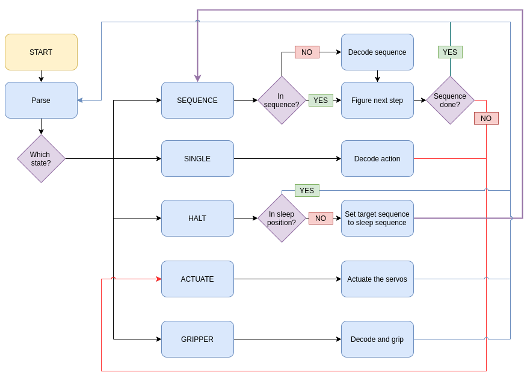
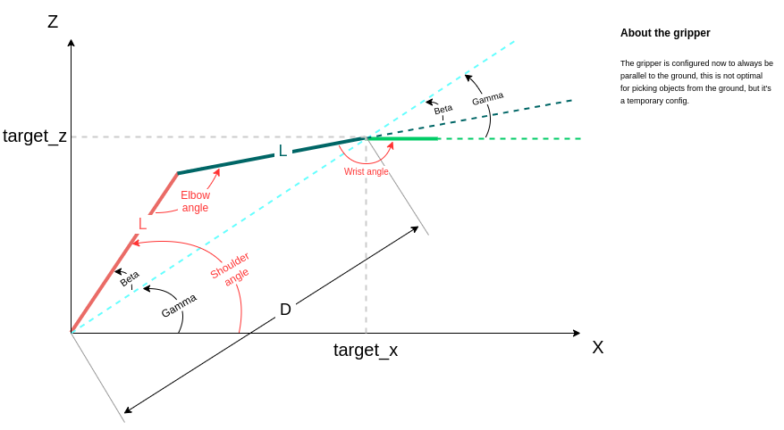

# Robotic arm firmware 

## System design

The robotic arm firmware is designed to be an RTOS system, where there'll be 2 main task, and a serial printing task for debugging purposes.

The two main tasks serve as the **commands parser** (from the high level controller, being the ros node, or any commanding system), and the **robotic arm driver**.

The **robotic arm driver** is designed to receive **4 different types of commands**:

- **d\*\*\*\*\0** : if the command starts with a 'd' char, the robotic arm is to go through the sequence of points with id_ == "***\0" (\* : char)
- **n\*\*\*\*\0** : if the command starts with a 'n' char, the robotic arm is to go to the point X = \*\*(1st 2\*), Z = \*\* (2nd 2\*)
- **g\*\*\*\*\0** : if the command starts with a 'g' char, the robotic is to actuate the gripper with Open = \* (1st \*), and percentage of opening/closing == \*\*\*% (2nd, 3rd, 4th \*)
- **h\*\*\*\*\0** : if the command starts with a 'h' char, the robotic is to halt and enter "sleep mode" but before that it shall take the default position 0000 (reserved for "closed")

This diagram is a primary design for the software:

> System design diagram
 
## Reverse kinematics approach

> Reverse kinematics approach

My approach was:

- 1st step: Calculate the distance **D**
- 2nd step: Calculate the **Beta** angle
- 3rd step: Calculate the **Gamma** angle
- 4th step: Calculate the **Shoulder**, **Elbow**, and **Wrist** angles

## Test and progress

> Running demo of the logic flow

## Implementation

~This is a work-in-progress and minimal advancements have been made in the code, except for the serial printing task, the two main tasks are still in dev phase.~

The arm animation task have been mostly implemented except for the servo actuation. Otherwise, a serial command parsing task have been implemented for testing purposes but the real task is to be implemented next (will communicate with ROS).

